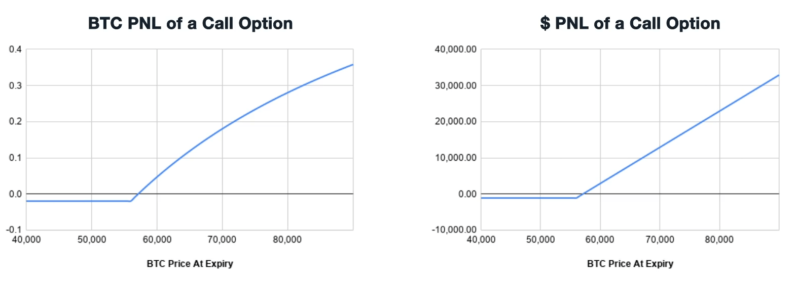

```
모든 옵션 상품 표현 규칙이나 거래 규칙은 Deribit 기준임
```

## 크립토 옵션 표기법 및 특징

```
기초자산 – 만기일 – 행사가격 – 옵션 종류
ex) BTC – 30OCT20 – 13000 – C
    BTC 콜옵션, 2020년 10월(OCT) 30일 만기, 13000 행사가
```

## deribit 특이 사항들

- Deribit은 모두 유러피안 옵션임.
    - 유러피안 옵션인데 유동성이 없어서 내 옵션을 반대매매해서 넘길 사람이 없다? 이건 해당 옵션의 시간가치가 있을 때 팔아치울 수가 없다는 말임.
      즉, 유동성 없는 OTM 옵션들은 그냥 휴지조각임(옵션 가치 = 내재가치 + 시간가치이므로) 그냥 만기까지 들고가서 exercise할수밖에. 그래서 옵션도 유동성 문제에서 자유로울 수 없음
- Deribit의 BTC 옵션은 multiplier가 1 (일반적으로 주식 기반 옵션은 multiplier가 100)
- Deribit에서는 Black Scholes 계산 시 금리와 배당률을 실제로는 0으로 가정한다. 즉, 외재가치에 대한 팩터로 만기까지 남은 시간, 내재변동성(IV), 기초자산 가격과 행사가의 상대 위치만 적용됨
- 만기시 가격은, 만기 시각 이전 최종 체결가가 아니라. `만기 직전 30분 동안의 평균 가격(TWAP)` 으로 측정됨. 예를 들어 5시 만기면 4시 반 ~ 5시 까지의 체결 가격의 TWAP이 그 기준임. 만기 직전 가격조작 방지를 위한 방법임

## payoff curve

BTC option의 경우 settle이 dollar가 아니라 BTC로 이뤄짐. (BTC-settle. USD 기준 payoff를 BTC로 다시 환산해서 정산)
그래서 만기 때의 call 매수자의 pnl 그래프는 아래와 같이 직선이 아닌 curve 형태임. (put도 마찬가지로 curve 형태임)


