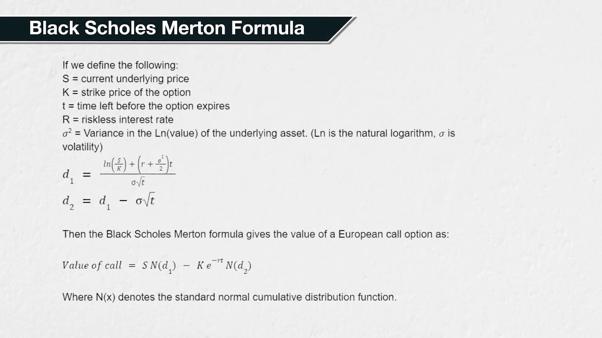

## Black Scholes Merton Model (BSM Model)

옵션 가격과 greeks를 뱉는다  
실제로 맞는지의 여부보다는 pricing engine으로써 그냥 공통된 iv, greeks를 보기 위한 도구임  
그 외의 이론적인 옵션 가격 공식들도 존재하는데... 실용적인 목적에서는 중요도가 떨어진다고 판단하여 더 찾아보진 않을 예정

직관적으로 이해해보자면 그냥 몇가지 input이 있고, output으로 greeks와 옵션 가격이 나오는 것에 불과함.

```
option price = f(S, K, T, r, IV, (dividend))
```

- BSM이 하고 있는 일부 가정들
    - returns는 정규 분포이며 price는 로그정규분포이다.
    - 유러피언 옵션을 가정한다
    - 거래에 fraction이 없는 시장을 가정한다. 거래비용, 규제 등은 존재하지 않는다.

### formula

- 콜가격  
  $C = S_0 N(d_1) - K e^{-rT} N(d_2)$

- 풋가격 (보통 쿳-폴 패리티 공식에 의해 유도되는 경우가 많음)  
  $P = K e^{-rT} N(-d_2) - S_0 N(-d_1)$

$S_0$ : 현재 기초자산 가격  
$K$ : 행사가  
$T$ : 만기까지 남은 시간  
$r$ : 무위험 이자율  
$\sigma$ : 기초자산의 변동성  
$N(x)$ : 표준정규분포의 누적분포함수 CDF (<- 고등학교 때 외웠던 그거)  
$e^{-rT}$ : 할인계수



## Jump Diffusion Model

- 갑작스러운 갭/뉴스/이벤트 리스크를 반영하여, moneyness 기준이 Jump 하는 것을 고려한 모델
