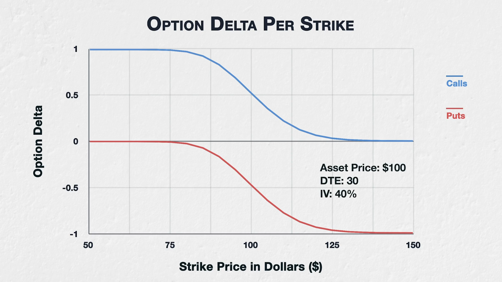
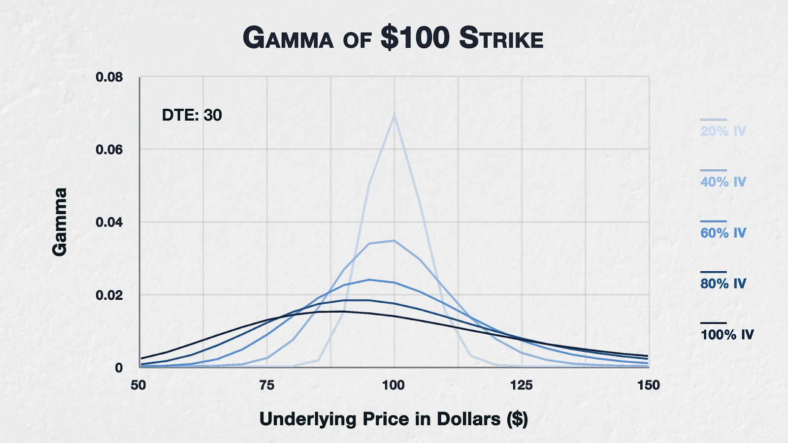
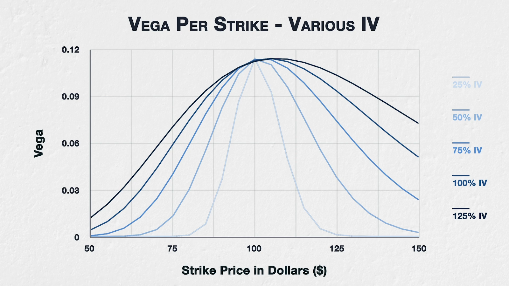
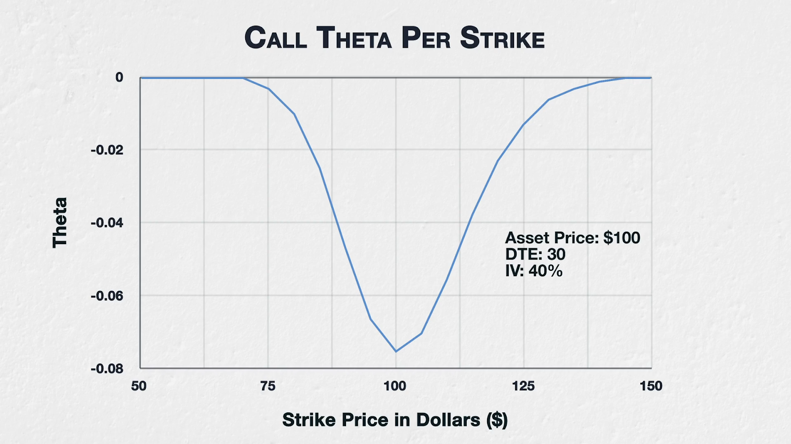
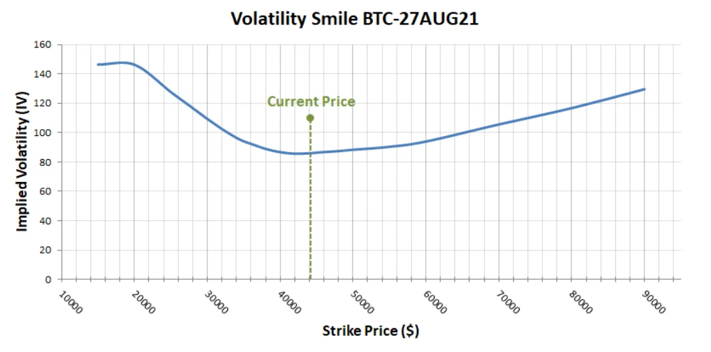
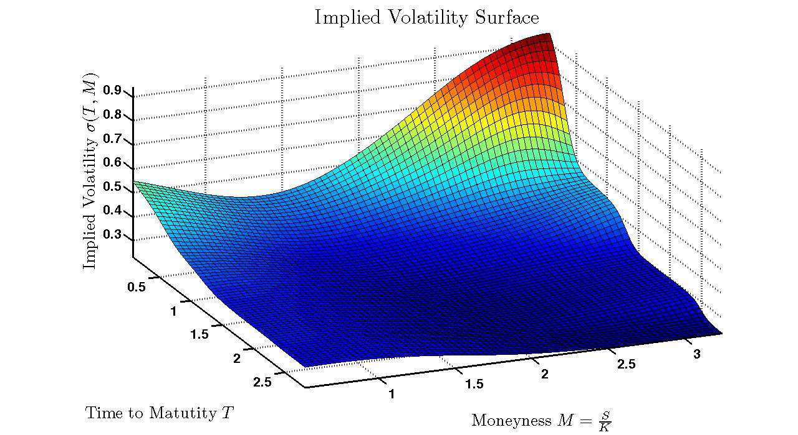

## payoff convexity

```
S : 기초자산(Spot), K : 행사가(Strike Price)라 하자, 만기까지 보유시 pnl은 다음과 같다.

call 매수 : max(S - K, 0) - premium
    - call 옵션의 payoff = max(S - K, 0)
    - 콜옵션 매수자의 pnl * -1 = 콜옵션 매도자의 pnl (콜옵션 매수자 pnl + 콜옵션 매도자 pnl = 0)
put 매수 : max(K - S, 0) - premium
    - put 옵션의 payoff = max(K - S, 0)
    - 풋옵션 매수자의 pnl * -1 = 풋옵션 매도자의 pnl (풋옵션 매수자 pnl + 풋옵션 매도자 pnl = 0)
```

- 선물은 linear한 손익 그래프 형태를 보이지만 옵션의 payoff는 `convex`함.  
  따라서 작은 변동성에서는 오히려 선물보다 수익이 안날수 있지만 변동성이 크기 움직일수록 더 크게 수익을 얻을 수 있음
- 비선형 payoff라는 말은 다른 말로 하면 `gamma exposure` 가 있다는 뜻임.  
  기초자산의 가격 움직임에 비해 파생 상품인 옵션의 가격은 델타대로만 움직이지 않고, 변동된 델타대로 움직이기 때문(델타의 기울기가 고정되어있지 않음)
- 물론, 중간에 옵션을 반대매매를 통해 net position을 0로 만든다면, 옵션 매수가 - 옵션 매도가가 그 수익임

## 시간가치

```
가격 = 내재가치(payoff) + 시간가치
∴ 시간가치 = 가격 - 내재가치
```

- 내재가치를 지금 당장 옵션 권리를 실행한다고 가정하고 얻을 수 있는 payoff라고 생각하면 편함
- 일반적으로 T(만기까지 남은 시간)가 클수록, ATM에 가까울수록, IV가 높을수록 외재 가치가 크다

## option chain

각 컬럼에 무엇을 표현할지는 커스텀이지만, 좌측에 콜, 가운데 행사가, 우측에 풋을 두는 건 일종의 규칙처럼 굳어짐

| Call Ask | Call Bid | Call Δ | Call IV | Strike  | Put IV | Put Δ | Put Bid | Put Ask |
| -------- | -------- | ------ | ------- | ------- | ------ | ----- | ------- | ------- |
| 5,200    | 5,100    | 0.82   | 58%     | 90,000  | 72%    | -0.18 | 120     | 150     |
| 3,400    | 3,300    | 0.68   | 60%     | 95,000  | 68%    | -0.32 | 320     | 360     |
| 1,800    | 1,750    | 0.51   | 64%     | 100,000 | 64%    | -0.49 | 1,700   | 1,760   |
| 850      | 820      | 0.34   | 70%     | 105,000 | 61%    | -0.66 | 3,250   | 3,350   |
| 320      | 300      | 0.19   | 78%     | 110,000 | 59%    | -0.81 | 5,000   | 5,120   |

## greeks

```
Delta는 기초자산 가격 변화에 대한 옵션 가격의 1차 민감도입니다.
콜옵션은 양의 delta를 가지고, 풋옵션은 음의 delta를 가집니다. 따라서 delta는 옵션 포지션이 기초자산 방향성에 얼마나 노출되어 있는지를 보여주는 지표로 볼 수 있습니다.
- 델타가 0.4인 옵션은 기초자산 가격이 1달러 상승하면 옵션 가격이 약 0.40달러 상승할 것으로 예상된다는 의미이다.

Gamma는 기초자산 가격 변화에 따라 delta가 얼마나 변하는지를 나타내는 2차 민감도입니다.
옵션은 선형 상품이 아니기 때문에 spot이 움직이면 delta도 변합니다. 옵션 매수자는 일반적으로 long gamma 포지션이며, 큰 가격 움직임에서 유리한 convexity를 가집니다.
- 감마가 0.01인 옵션은 기초자산 가격이 1달러 상승하면 델타가 0.01 증가할 것으로 예상된다는 의미이다.

Vega는 implied volatility 변화에 대한 옵션 가격의 민감도입니다.
옵션 매수자는 일반적으로 long vega 포지션이므로 IV가 상승하면 유리하고, 옵션 매도자는 short vega 포지션이므로 IV 상승에 불리합니다.
- 베가가 4인 옵션은 내재변동성이 1% 상승하면 옵션 가치가 4달러 상승할 것으로 예상된다는 의미이다.

Theta는 시간 경과에 따른 옵션 가치의 민감도입니다.
옵션 매수자는 만기까지 남은 시간이 줄어들수록 시간가치가 감소하기 때문에 일반적으로 short theta이고, 옵션 매도자는 시간가치 감소를 수익원으로 삼을 수 있기 때문에 long theta입니다.
- 세타가 -0.15달러인 옵션은 현재 하루에 0.15달러의 속도로 가치가 감소하고 있다는 의미이다. 다만 이 속도는 static하지 않음. 항상 변화함
```

## greeks에서의 l/s

long gamma = gamma exposure가 양수  
short gamma = gamma exposure가 음수

```
delta exposure = 방향성 리스크를 들고 있음
gamma exposure = 방향성 노출이 변하는 리스크를 들고 있음
vega exposure = IV 변동 리스크를 들고 있음
theta exposure = 시간가치 감소/획득에 노출되어 있음
```

예시

```
콜옵션 매수 → long delta, long gamma, long vega, short theta
콜옵션 매도 → short delta, short gamma, short vega, long theta
현물 매수 → long delta, gamma 거의 없음, vega 없음, theta 없음
```

## delta

- 개괄
    - `-1 <= delta <= 1`
    - 현물, 선물은 delta 1로 간주
    - 소수점을 떼고 부르기도 함. 25d call = 0.25 delta call
    - 콜/풋의 매도자는 각 옵션에 \* -1 을 취한다. 예를 들어 25d call 매도자는 -0.25의 델타를 가지고 있다
    - 콜옵션은 기초 자산 가격이 오를수록 이득이라서 delta가 양수, 풋옵션은 기초 자산 가격이 오를수록 손해라 delta가 음수
    - DTE 직전, ATM 근처 옵션의 경우 delta를 ITM 으로 끝날 확률로 휴리스틱하게 보기도 함

- moneyness와 delta간의 관계
    - 깊은 ITM일수록 +-1에 가까워짐
    - 깊은 OTM일수록 0에 가까워짐
    - ATM은 +=0.5 정도임

| CALL delta    | Strike Price | PUT delta    |
| ------------- | ------------ | ------------ |
| 0.5 ~ 1 (ITM) | 50           | -0.5~0 (OTM) |
| 0.5 (ATM)     | 100          | -0.5 (ATM)   |
| 0 ~ 0.5 (OTM) | 150          | -1~-0.5(ITM) |



- IV와 delta간의 관계
    - IV가 클수록
        - ITM 옵션의 델타는 더 작아짐 -> 수익권을 벗어날 가능성이 있으므로 기초 자산 $1 변동에도 가치를 좀 더 낮게 쳐줌
        - OTM 옵션의 델타는 더 커진다 -> 수익권으로 들어갈 가능성이 있으므로 기초 자산 $1 변동에 더 큰 가치를 쳐 줌
    - IV가 작을수록
        - ITM 옵션의 델타는 더 커진다 -> 이미 수익권이고, 수익권을 벗어날 확률(변동성)이 적으므로
        - OTM 옵션의 델타는 더 작아짐 -> 크게 변하지 않으므로 미래에도 OTM일 가능성이 더 높으므로

- DTE와 delta간의 관계
    - 높은 DTE
        - ITM 옵션의 델타를 더 작게 만듦 -> 아직 시간 있으니 수익권 바깥으로 튕겨나갈 수도 있음
        - OTM 옵션의 델타를 더 크게 만듦 -> 아직 시간 있으니 수익권으로 들어갈 수도 있음
    - 낮은 DTE
        - ITM 옵션의 델타를 더 크게 만듦 -> 좀만 버티면 수익 확정
        - OTM 옵션의 델타를 더 작게 만듦 -> 수익권으로 진입한 시간이 얼마 남지 않음

## gamma

- 개괄
    - 기초자산 가격이 $1 상승했을 때 옵션 델타가 얼마나 변할 것으로 예상되는지
    - 옵션 매수자 -> gamma > 0
    - 옵션 매도자 -> gamma < 0

- moneyness와 gamma간의 관계
-   - ATM 부근이 delta 변화가 가장 급격해서 gamma가 가장 크다. 깊은 ITM/OTM으로 가면 gamma는 다시 0에 가까워진다
    - 동일한 행사가와 동일한 만기일을 가진 콜옵션과 풋옵션은 같은 감마 값을 가진다.
    - IV(내재변동성) 및/또는 DTE(잔존만기)가 훨씬 더 높은 경우에는 감마의 최고점이 기초자산 가격보다 더 높은 행사가에서 나타날 수도 있지만, 일반적으로 ATM 옵션이 가장 큰 감마를 가진다.

- IV와 gamma간의 관계
    - gamma peak는 꼭 ATM이 아님.
    - 낮은 IV에서는 ATM 부근에서 delta 변화가 가장 급격하므로 gamma peak가 ATM 근처에 생긴다.
    - 그런데 IV가 증가하면 가격 분포가 넓어져 살짝 OTM도 ITM로 들어올 수 있다고 생각해서 delta가 크게 움직일수도 있다는 기대 심리 때문임(gamma peak)



- DTE와 gamma간의 관계
    - DTE 낮아지면,
        - ITM, OTM 둘다 gamma가 감소함.
        - ATM는 작은 움직임만으로 ITM, OTM이 결정되므로 gamma가 급격히 증가함

## vega

- 개괄
    - IV 변화에 대한 옵션 가격의 민감성
    - 옵션 매수자의 vega는 양수이고, 매도자는 음수임. (IV 증가하면 옵션 가격도 오르기 때문에 콜/풋 타입 차이 무관)
    - 베가가 20인 옵션은 내재변동성이 1% 증가하면 가치가 $20 상승합니다. 이는 옵션 매수자에게는 $20의 수익 증가를 의미하고, 옵션 매도자에게는 $20의 손실 증가를 의미합니다.
    - 같은 행사가와 같은 만기일을 가진 콜과 풋은 동일한 베가 값을 가짐

- moneyness와 vega간의 관계
    - ATM에서 제일 크고, ITM, OTM 방향으로는 vega가 감소함.

- IV와 vega간의 관계
    - IV ↑ -> Vega ↑ 이지만, ITM, OTM에서 그 상승폭이 큼.
    - ATM은 여전히 Vega Peak 지만, IV가 커지고 작아지는데는 크게 변화하지 않음.
    - 아래 그림을 보면, IV 가 증가함에 따라 ITM, OTM의 전체 vega 가 상승하지만 ATM은 그냥 peak에서 거의 변화 없이 머무르고 있음



- DTE와 vega간의 관계
    - DTE ↑ -> Vega ↑ (시간 많이 남았으면 외재가치도 크고, IV의 움직임을 비싸게 쳐줄 수 있기 때문)
    - DTE ↓ -> Vega ↓

## theta

- 개괄
    - 옵션 매수자 기준 theta <= 0, 매도자는 \* -1 처리.
        - theta가 '높다' 라고 한다면 보통 절대값 기준을 말함. ex) theta -0.3 은 theta -0.2보다 '높다'
    - 옵션 매수자에게는 항상 음수. 시간이 흐를수록 해당 옵션의 가능성은 닫혀 간다 (time decay) 반대로 옵션 매도자에게는 항상 양수
    - 시간이 줄어들수록 abs(theta)는 가속이 붙는다.
    - 세타가 -12.55인 옵션은 다음 하루 동안 $12.55의 가치를 잃을 것으로 예상된다.

- moneyness와 theta간의 관계
    - ATM에 가까울수록 abs(theta)가 크다. 미래 결과 uncertainty가 최대라서.
    - OTM이 시간이 흐를수록 ITM로 못 빠질 가능성이 더 크니까 abs(theta)가 제일 크다고 생각할수도 있는데, 대부분 deep OTM은 애초에 생각하지도 않고, 무가치라 평가함. 결론적으로는 '불확실성' 기준으로 theta가 산정됨.



- IV와 theta간의 관계
    - 높은 IV → 높은 theta (변동성이 높아 생기는 반전의 기회를 실현시킬 시간이 점차 줄어드니 더 theta가 빨리 빠짐)
    - 낮은 IV → 낮은 theta

- DTE와 theta간의 관계
    - DTE 높음
        - ITM, OTM 의 theta가 높음
        - ATM의 theta는 낮음
    - DTE 낮음
        - ITM, OTM의 theta는 낮음
        - ATM의 theta는 높음

## 추가 greeks

### vanna

```
Vanna = ∂Delta / ∂σ
```

### charm

- 시간이 지나면서 델타가 변하는 속도

```
Charm = ∂Delta / ∂Time
```

## IV(Implied Volatility)

- 옵션 가격 이론에 따라 도출되는, 옵션 시장 참여자들의 바라보는 기초 자산의 변동성
    - 옵션 가격 이론 공식에서 도출되었다는 점에서 부터 IV는 이미 옵션 가격에 반영된 것으로 봐야한다
    - 옵션에 투자한다면 실제 변동성(RV)가 IV보다 더 크게 실현될 것으로 베팅하는 것임
    - (price → 결과)인 반면에 (IV → **기대 + 리스크 프라이싱**) 일반적으로 옵션 시장이 주식 시장보다 더 크고 정보가 많아서 옵션이 선행한다고 봄.

- IV에 기반한 수식을 뽑아낼때 wq에서는 아래 같은 것들을 많이 썼음
- 명확한 수식이 없음. 어디에서는 put - call을 하라고 하기도하고 순서를 바꾸기도 하고

```
implied_volatility_call // ATM call의 IV
implied_volatility_put // ATM put의 IV
implied_volatility_mean  // ATM 옵션의 평균 내재변동성. (call + put) / 2 랑 똑같음.
25-delta put skew = IV(25Δ put) - IV(25Δ call) // 가장 많이 씀
```

## volatility smile (IV surface의 단면)

실제로는 iv smile이라고 불러야 더 맞지 않을까함.

이론적 Black-Scholes에서는 모든 IV가 동일하지만(IV flat),  
실제로는 ATM에서 IV가 제일 낮고, ATM에서 멀어질수록 양쪽으로 IV가 커지는 형태, 즉 smile shape가 보임.  
이론에서는 returns가 정규분포라 가정하지만, 실제로는 fat tail 분포를 보이기 때문에.

일반적으로 왼쪽: OTM put IV, 중앙: ATM IV, 오른쪽: OTM call IV 을 기준으로 그린다.  
그래서 곡선이 왼쪽으로 높으면 "put이 비싸다", 오른쪽으로 높으면 "call이 비싸다"라고 말하는 것이다.

또한, IV smile은 완전히 symmetric한 형태는 아님. 하방 위험을 두려워하는 경향이 큰 참여자가 많아지면 낮은 행사가쪽의 IV가 더 오름



저 smile 곡선의 skew에 따라 아래 같이 구분해볼 수 있음

```
- Reverse skew(smirk)
낮은 행사가의 IV가 더 높음

- Forward skew
높은 행사가의 IV가 더 높음

- Frown
ATM 옵션에 제일 높은 smile의 반대 형태인데 현실 세계에서 보기 쉽지 않음
```

## IV surface (vol smile에 시간축)

변동성은 아래 두 요소로 분리해서 생각할 수 있음

- **스큐(skew)**: 행사가격에 따라 변동성이 다르고 -> vol smile 곡선
    - OTM put IV ↑ → 하방 공포
    - OTM call IV ↑ → 상방 투기
- **기간 구조(term structure)**: 만기에 따라 변동성이 다르다
    - 단기 IV ↑ → 이벤트 / 불확실성 imminent
    - 장기 IV ↑ → 구조적 불안

vol smile을 시간축으로 쌓은 것을 IV surface라 본다.



```
X: 만기 / Y: strike / Z: IV
```

- 이걸 가지고
    1. mispricing 잡거나
        - IV 과대 → 옵션 overpriced → sell vol
        - IV 과소 → buy vol
    2. regime 읽거나

        ```
        flat → 안정 시장
        skew deep → crash risk regime
        term steep → event regime
        ```

    3. signal 만든다
        - Δ surface (시간 변화) 가 중요. 갑자기 put iv가 급증한다던가, 단기 IV가 장기 IV를 역전한다던가(보통 장기에 무슨 일이 있을지 모르니 장기 IV > 단기 IV가 노멀임)

## multi leg에서의 greeks

총 Greek = Σ(각 옵션 leg의 Greek × 포지션 수량)

예시:

```
100 콜 매수 1개
Delta +0.55
Gamma +0.04
Theta -0.08
Vega +0.12

110 콜 매도 1개
Delta +0.30
Gamma +0.03
Theta -0.05
Vega +0.09

Bull Call Spread의 총 Greeks:

Delta = (+0.55 × 1) + (+0.30 × -1) = +0.25
Gamma = (+0.04 × 1) + (+0.03 × -1) = +0.01
Theta = (-0.08 × 1) + (-0.05 × -1) = -0.03
Vega  = (+0.12 × 1) + (+0.09 × -1) = +0.03
```

## term structure(만기구조)

만기별로 IV가 어떻게 배열되어 있는지.

보통 만기가 짧을수록 IV가 낮고 길면 IV가 높음.

## useful tools

http://www.option-price.com/  
https://www.philadelphia-reflections.com/blog/2394.htm
