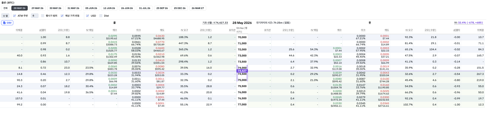

## oneline

```
0DTE 옵션의 IV에 기반한 price range를 기반으로 polymarket 상품에 베팅한다.
```

## seed idea

- a월 b일 비트코인 가격은? -> 가격 범위를 맞추는 Short Strangle 과 유사한 상품임
    - polymarket 판단 기준은 ET timezone 12:00(noon) 기준 binance 1분 봉의 종가 기준임. UTC 기준으로 환산하면 16시임.
    - deribit의 옵션 만기 시간은 UTC 08:00 만기임.
    - x일의 가격 range 추측에 즉각적으로 사용 가능한 옵션은 0DTE, 1DTE 옵션이며, 0DTE 만기 후 8시간이 비게 됨. (약점)
    - 0DTE 옵션의 IV를 1 sigma 처리 후 drift를 제외하여 단순화하면 아래와 같은 가격 range를 추산할 수 있으며 UI에 노출되어 있음
        - price가 log normal dist라는 가정 하라서, 실제는 저것보다 저 타이트하게 봐야하는데, 애초에 polymarket range가 넓어서 괜찮을 듯

$F \cdot e^{-\sigma\sqrt{T}} <= x <= F \cdot e^{\sigma\sqrt{T}}$



## 결론

    - 손으로만 매매하고 코드짜지 않는다.
      - 가격 range가 2,000$ 단위임. 꽤 range 범위가 넓음. 정확한 range를 예측하려는 것은 over engineering으로 판단됨. 손으로만 한다.
    - 24시간 내 결정나는 상품만 다룬다
      - 시간이 짧을수록 IV가 실제 움직임을 더 타이트하게 반영하므로 더 먼 기간의 polymarket bet을 하는 건 불확실성이 큼
    - 동일 금액으로만 베팅한다
      - 옵션 IV 기반 range 산정시 신뢰 범위 1시그마(68%) 정도로 산정했고 이것 안에 가격이 들어오는데 베팅한 것이므로 동일 금액을 베팅해야 해당 전략의 유의미성을 판단할 수 있음.
    - 가격에 큰 변화를 줄 수 있는 이벤트 때는 베팅하지 않는다.

## tracking

- 5월 28일 상품
    - 15시간 남았을 때 진입.
